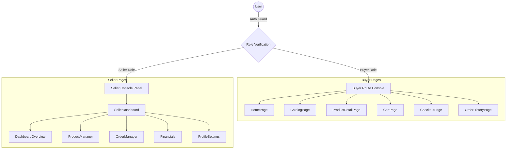

# Merchora.shop – Product & Architecture Reference Guide

Welcome to the official developer reference manual for **Merchora.shop**. This document details the functional specifications, page routing, state context layouts, styling variables, and AI agent logic designed to operate within a dual-sided React e-commerce application.

---

## 🏗️ 1. Core Architectural Concepts

Merchora.shop is built as a **dual-sided marketplace** that separates the capabilities of **Buyers** (who search catalog items and purchase via escrow) and **Sellers** (who control listings, manage inventory, and fulfill incoming orders).

---

## 📦 2. Technical Stack & State Contexts

*   **Foundation**: React v18 + Vite bundler (fully compiled and production-build verified).
*   **Styling System**: 100% Custom Vanilla CSS system ([index.css](file:///Users/anica/Merchora/src/index.css)) utilizing HSL colors, responsive variables, glassmorphic headers, and dark/light theme options (synchronized with `localStorage` and HTML attributes).
*   **Database Sync Engine**: [mockDb.js](file:///Users/anica/Merchora/src/services/mockDb.js) handles simulated database actions (CRUD) and persists states inside the browser's `localStorage` namespace. It includes an auto-seeder generating a catalog database of **100 products**.

### React State Contexts

We use six decoupled React Context providers to handle global state management:
1.  **AuthContext**: Manages active sessions, registration, profiles, and watches for inactivity (auto-logout security triggers after 10 minutes of idle inactivity).
2.  **CartContext**: Syncs buyer items, checks stock levels in real time against the catalog state, and processes coupons.
3.  **ProductContext**: Controls the global master list of catalog listings and product details across categories.
4.  **OrderContext**: Synchronizes order creation for buyers and fulfillment status tracking for sellers.
5.  **ToastContext**: Manages the floating notification stack in the top-right corner.
6.  **CurrencyContext**: Converts prices across multiple currencies dynamically based on billing region.

---

## 🏷️ 3. Database Schema & Seeder Categories

The dummy database supports **10 marketplace departments**:

| Category | Icon (Lucide) | Seeder Content Examples |
| :--- | :--- | :--- |
| **Apparel** | `Shirt` | Polo Shirts, Denim Jackets, Summer Dresses |
| **Electronics** | `Tv` | Charging Pads, Power Banks, Smart Speakers |
| **Footwear** | `Footprints` | Chelsea Boots, Gym Trainers, Slides |
| **Accessories** | `Backpack` | RFID Wallets, Sunglasses, Laptop Sleeves |
| **Home & Living** | `HomeIcon` | Soy Candles, Memory Foam Pillows, Mugs |
| **Beauty & Personal Care** | `Sparkles` | Organic Face Serums, Lipsticks, Oils |
| **Sports & Outdoors** | `Dumbbell` | Yoga Mats, Vacuum Flasks, Dumbbells |
| **Books & Media** | `BookOpen` | Art Guides, Cookbooks, Fiction Anthologies |
| **Toys & Games** | `Gamepad2` | Building Blocks, Strat Board Games, RC Cars |
| **Automotive** | `Car` | Tire Inflators, Floor Mats, Dash Cams |

---

## 📱 4. Responsiveness & Usability Controls

The layout is optimized for mobile, tablet, and desktop viewports:

*   **Advanced Mobile Header**: Below `768px`, the search bar wraps to its own row. The shopping cart icon with active badges remains visible at the top next to the mobile menu toggle.
*   **Collapsible Catalog Filters**: On smaller screens, product category filters collapse behind a single button so users don't have to scroll past filter options to see products.
*   **Horizontal Scroll Seller Sidebar**: On mobile, the vertical seller sidebar navigation collapses into a horizontal navigation row, keeping dashboard screens readable.

---

## 🤖 5. Conversational AI Shopping Agent

The floating chat widget inside [App.jsx](file:///Users/anica/Merchora/src/App.jsx) acts as a virtual assistant:

*   **Database Search**: Parses the 100-item database to recommend products (e.g., "show me shoes under $50").
*   **Deep-Link Cards**: Generates clickable product preview cards directly inside the chat bubbles so users can navigate to product details instantly.
*   **E-Commerce Knowledge**: Answers questions about payments, secure escrow holds, 30-day refunds, flat shipping rates, commission splits, and bank payouts.

---

## 🔒 6. Key Business & Security Safeguards

*   **Commission Fee**: Flat 10.0% service split subtracted automatically from the seller's gross payable balance.
*   **Escrow Ledger**: When checkout completes, buyer payments are locked in escrow. Payouts are only released to the seller after they provide package carrier tracking details.
*   **Auto-Logout Watchdog**: The system listens to user activity (mouse movement, keystrokes) and logs out active accounts after 10 minutes of inactivity to protect shared terminals.
